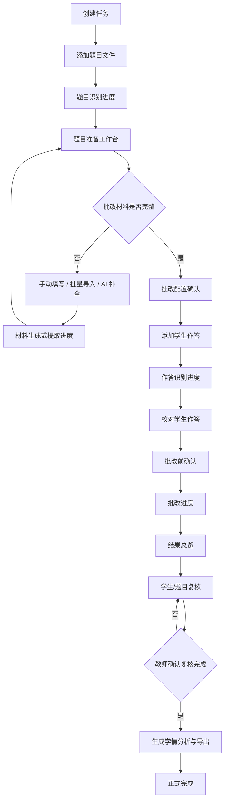
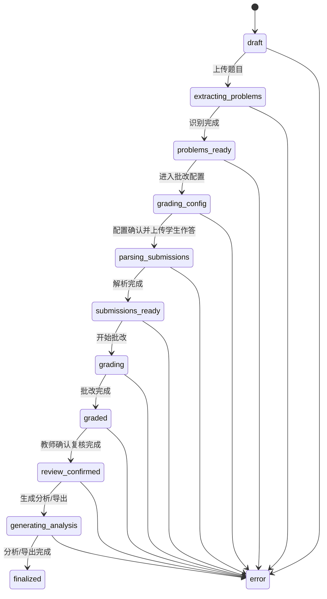
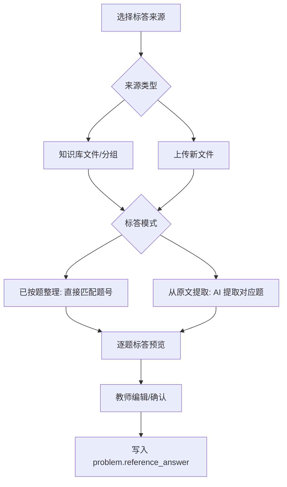
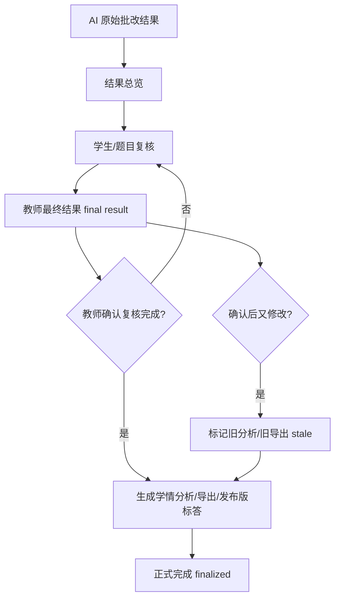

# SmarTAI 前端体验重构计划（2026-07-03）

> 目的：把 SmarTAI 从“功能堆在页面上”改成“流程自然带着教师完成批改、并且觉得它聪明好用”的产品体验。
> 本计划不是回到旧版 Streamlit/Reflex 的设计，而是吸收旧版“少干扰、流程直接”的优点，重新设计一个更像成熟教学产品的前端工作台。
> 本阶段先聚焦信息架构、页面流程、交互状态、产品高光能力和前后端边界；视觉品牌、配色、插图、动效作为后续阶段统一打磨。

---

## 0. 核心判断

当前前端最大问题不是缺一个更漂亮的皮肤，而是页面把太多概念同时摊开：任务资料、个人知识库、BYOK、批改风格、质量阈值、题目上传、作答上传、进度反馈分散在多个框里，用户很难判断“现在该做什么、下一步会发生什么、点了按钮到底有没有生效”。

建议采用以下原则：

- **一页一栏**：任务工作流页面只使用单栏纵向信息流；不再在一个页面里左右分栏承载两个主任务。
- **少框、少嵌套**：页面 section 用自然分隔、折叠面板和列表，不做卡片套卡片。
- **默认简单，高级折叠**：先展示完成当前阶段必须做的 1-3 件事；专家组合、测试样例、评分阈值、沙盒超时等放进“编辑设置”或“高级设置”。
- **按阶段配置**：配置项不再集中塞到一个“批改配置”页，而是放到真正需要它的阶段。
- **自动进入进度页**：上传或启动任务后跳到干净的进度界面，自动跟进状态，完成后自动展示可校对的结果。
- **任务并行互不影响**：每个任务有独立状态、进度、ETA 和入口；历史页像网盘一样清楚显示每个任务卡在哪一步。
- **资料统一表达为“添加资料”**：任务资料、个人知识库、标答、测试样例都从统一资料选择器进入，避免重复概念。

### 0.1 不是回到旧版，而是做更好的产品

旧版值得参考的是“上传 -> 识别 -> 确认”的直接感，不值得照搬的是原型工具式的粗糙界面。新版目标不是更像 Streamlit，而是更像一个教师愿意长期使用的 AI 批改工作台：

- **有产品主线**：系统主动告诉老师现在该做什么，而不是把所有选项摊给老师。
- **有智能辅助**：AI 不只在后台批改，也帮老师整理资料、匹配标答、生成测试样例、找低置信复核点。
- **有任务驾驶舱**：多个任务可以并行，老师像管理网盘/任务队列一样管理批改工作。
- **有复核效率**：完成后不是给一堆结果，而是直接把最值得老师看的地方排在前面。
- **有可交付成果**：最后能生成给学生/助教/课程使用的报告、发布版标答、易错点总结。

### 0.2 让用户眼前一亮的产品高光

- [ ] WOW-01 **任务驾驶舱**：Dashboard 和 History 像批改任务控制台，显示每个任务阶段、进度、ETA、待复核数和下一步。
- [ ] WOW-02 **智能资料库**：知识库像课程网盘，文件可分组、打标签、跨任务复用；任务里只需要“添加资料”。
- [ ] WOW-03 **AI 题目整理助手**：题目识别后自动生成题型、分值建议、评分标准草稿、标答匹配状态、测试样例建议。
- [ ] WOW-04 **干净的进度剧场**：上传后自动跳到清爽进度页，显示当前子步骤、已完成数量、预计剩余时间和后台运行入口。
- [ ] WOW-05 **复核热力图**：结果页先给学生 x 题目的置信度/复核矩阵，老师直接点击最值得看的格子。
- [ ] WOW-06 **自然语言筛选**：在题目、学生作答、结果页都能问“找证明题”“找第 3 题低置信学生”“找排序算法相关题”。
- [ ] WOW-07 **解释型批改详情**：每题展示评分依据、引用资料、标答/测试样例、专家分歧和需要复核原因。
- [ ] WOW-08 **发布版标答生成**：批改后结合原标答、学生常见错误、AI 更优解法，生成只包含本次作业的可下载标答。
- [ ] WOW-09 **复核队列**：自动把低置信、专家分歧大、分数异常、缺失作答排成待处理清单。
- [ ] WOW-10 **课程记忆**：下次同课程任务可复用上次的资料分组、评分习惯、专家组合和导出模板。

---

## 1. 待确认的关键产品决策

### 1.1 批改配置放在哪里

推荐不要保留一个很大的前置“批改配置”页，也不要把“校对题目”和“补充评分标准/标答/测试样例”做成两个看起来重复的页面。更好的结构是把它们合并为一个大的 **题目准备** 阶段：

```text
新建任务
  -> 题目准备
      添加/识别题目
      校对题目
      完善批改材料：评分标准 / 标答 / 测试样例
      确认题目准备完成
  -> 作答准备
      添加/识别学生作答
      校对学生作答
  -> 批改前确认（专家组合 + 资料范围 + 评分策略）
  -> 批改进度
  -> 结果复核与分析
```

原因：

- 题目没有识别出来之前，用户很难准确设置每题评分标准、标答、测试样例。
- 标答和测试样例往往要绑定到具体题号，最自然的位置是“题目准备页”的每题材料槽位。
- 标答本身可能需要 AI 识别或从整本书答案中提取，因此它需要一个可进入进度页的“批量导入/AI 提取”流程，但完成后仍回到同一个题目准备页。
- 评分标准、标答、测试样例一开始可以为空；教师可以手填、上传文件、从知识库选择，也可以让 AI 补全缺失项。
- BYOK/专家选择可以按阶段出现：题目识别、作答识别、正式批改都可以选择专家，但默认继承任务设置。
- 批改风格、严格度、低置信阈值、多专家组合属于“正式批改前确认”，不应该阻塞用户一开始上传题目。

已确认：

- [x] D-01 取消“大而全的批改配置页”，改成阶段式配置。
- [x] D-02 题目上传前只保留最小设置：使用哪个专家、是否启用 OCR/识别增强、是否已有参考资料。
- [x] D-03 评分标准、标答、测试样例主要放在题目识别后的“题目准备”工作台里，用每题材料槽位承载。
- [x] D-04 正式批改前增加一个“批改前确认”页面，汇总专家、资料、评分策略。
- [x] D-07 “批量导入材料”和“AI 补全缺失项”完成后回到同一个题目准备页，而不是跳到一个重复的新页面。题目准备页先显示总览表，点击题号或状态进入对应题目详情；人工修改或点击确认无误后自动更新总览状态。

### 1.2 “标答是干净的还是需要提取”的命名

不建议在 UI 里说“干净的标答”，这个词对教师不够明确。标答导入模式确认采用两项，并且两项旁边必须给清晰说明：

- **已按题整理**：适合教师已经准备好“本次作业逐题答案”的情况，例如 `Q1/Q2/Q3` 已分好段，或文件标题、题号与本任务题目基本对应。系统只做题号匹配、格式整理和低置信提示。
- **从原文提取**：适合答案来源很长或不只包含本次作业的情况，例如整本书课后答案、章节答案合集、讲义、截图或扫描件。系统需要先在原文中找到本次作业对应题目，再提取对应答案，并标出原文片段和匹配置信度。

已确认：

- [x] D-05 标答导入模式采用“已按题整理 / 从原文提取”两项；UI 旁边必须显示简短说明和适用场景。
- [x] D-06 不设置“仅作为参考资料，不生成逐题标答”作为第三种标答模式。标答最终一定要生成，但发布版标答应放在批改完成后，结合学生错误、AI 批改情况和更优解法针对性生成。

---

## 2. 目标用户流程

### 2.1 主流程图



### 2.2 阶段门禁



建议新增一个显式状态 `grading_config`，位于 `problems_ready` 和 `parsing_submissions` 之间。它对应我们讨论的“题目准备工作台 + 批改配置确认”：题目已识别完成，但教师还需要确认题目、评分标准、标答、测试样例、专家组合和资料范围，之后才进入学生作答上传。

状态中英文显示必须一起设计：

| backend status | 中文显示 | English label | 用户含义 |
|---|---|---|---|
| `draft` | 草稿 | Draft | 任务已创建，尚未上传题目 |
| `extracting_problems` | 题目识别中 | Recognizing problems | 后台正在识别题目 |
| `problems_ready` | 题目已识别 | Problems recognized | 题目识别完成，等待进入题目准备/批改配置 |
| `grading_config` | 批改配置 | Grading setup | 校对题目、补充材料、确认专家和资料范围 |
| `parsing_submissions` | 作答识别中 | Recognizing submissions | 后台正在识别学生作答 |
| `submissions_ready` | 作答已识别 | Submissions recognized | 作答已识别，等待开始批改 |
| `grading` | 批改中 | Grading | 后台正在批改 |
| `graded` | 批改完成，待复核 | Graded, pending review | AI 批改结果已生成，等待教师复核确认 |
| `review_confirmed` | 复核已确认 | Review confirmed | 教师确认最终结果，可以生成正式分析和导出 |
| `generating_analysis` | 分析与导出生成中 | Generating analysis and exports | 后台正在生成学情分析、导出报告和发布版标答 |
| `finalized` | 正式完成 | Finalized | 分析、导出和发布版标答已基于最终结果生成 |
| `error` | 需要处理 | Needs attention | 出现错误，但页面必须给出原因和恢复动作 |

若短期后端不立刻新增 `grading_config`，前端也可以先把 `problems_ready` 渲染为“题目准备 / Grading setup”子阶段；但长期建议后端状态机显式区分，避免历史页和阶段门禁无法准确表达。

同理，`review_confirmed`、`generating_analysis`、`finalized` 可先以前端派生状态实现，但长期应进入后端任务状态或结果版本状态。默认不在 `graded` 后立刻生成高成本学情分析和导出，而是等教师点击“确认复核完成”后再生成；`stale` 只用于“确认并生成后，教师又修改 final result”的情况。

页面规则：

- [ ] F-01 当前阶段之前的页面可以查看、修改、重新上传。
- [ ] F-02 当前阶段之后的页面不可直接操作；点击后显示“当前任务还在 X 阶段”，并提供跳转回当前阶段的按钮。
- [ ] F-03 顶部 stepper 只显示阶段和状态，不承担复杂说明。
- [ ] F-04 每个阶段的主按钮只保留一个最明显的下一步 CTA。
- [ ] F-05 重新上传会弹出强确认，明确说明会中断/覆盖已有识别结果。
- [ ] F-06 重新上传确认框提供“改为新建任务”的显著按钮。

---

## 3. 页面与文件结构计划

### 3.1 当前主要文件

- `frontend/app/src/routes/tasks/TaskSetupPage.tsx`
- `frontend/app/src/routes/tasks/TaskUploadPage.tsx`
- `frontend/app/src/routes/tasks/TaskResultsPage.tsx`
- `frontend/app/src/routes/tasks/TaskQuestionDetailPage.tsx`
- `frontend/app/src/routes/tasks/TaskStudentDetailPage.tsx`
- `frontend/app/src/routes/KnowledgeBasePage.tsx`
- `frontend/app/src/routes/ExpertsPage.tsx`
- `frontend/app/src/routes/DashboardPage.tsx`
- `frontend/app/src/routes/HistoryPage.tsx`
- `frontend/app/src/routes/LoginPage.tsx`
- `frontend/app/src/components/tasks/ResultsLayout.tsx`
- `frontend/app/src/hooks/useTaskProgress.ts`
- `frontend/app/src/api/tasks.ts`
- `frontend/app/src/types/task.ts`

### 3.2 建议新增/重组组件

- [ ] C-01 新增 `TaskStageGate`：统一处理未来阶段禁用、当前阶段跳转、错误态恢复。
- [ ] C-02 新增 `TaskProgressFocus`：全屏/单栏进度页组件，显示阶段、百分比、ETA、最新步骤、后台运行入口。
- [ ] C-03 新增 `MaterialPicker`：统一“从知识库选择 / 上传新文件 / 选择分组 / 全部资料”。
- [ ] C-04 新增 `ReferenceAnswerPanel`：标答来源、标答模式、逐题匹配状态、编辑和导出。
- [ ] C-05 新增 `ProgrammingTestsPanel`：测试样例来源、AI 生成数量、沙盒超时、逐题测试样例查看。
- [ ] C-06 新增 `RubricEditor`：总评分细则、逐题评分标准、严格度滑杆、部分分开关。
- [ ] C-07 新增 `ExpertRunSelector`：本次使用哪些专家，而不是修改全局启用状态。
- [ ] C-08 新增 `QuestionNavigator`：题号 chips、下拉选择、上一题/下一题。
- [ ] C-09 新增 `StudentNavigator`：学生搜索、排序、上一位/下一位。
- [ ] C-10 新增 `ConfidenceMatrix`：学生 x 题目的置信度/复核热力表。
- [ ] C-11 新增 `SmartFilterBar`：自然语言筛选题目、学生、结果。
- [ ] C-12 新增 `ConfirmReplaceDialog`：重新上传/覆盖/打断运行的统一确认框。
- [ ] C-13 新增 `QuestionPreparationWorkspace`：题目准备总容器，承载题目校对和每题材料槽位。
- [ ] C-14 新增 `MaterialCoverageBar`：显示题目、评分标准、标答、测试样例的覆盖率。
- [ ] C-15 新增 `ProblemMaterialSlot`：每题下面的评分标准/标答/测试样例槽位，显示来源和确认状态。
- [ ] C-16 新增 `BulkMaterialImportDialog`：批量导入评分标准、标答或测试样例，支持上传或从知识库选择。
- [ ] C-17 新增 `AICompleteMissingMaterialsAction`：一键让 AI 补全缺失评分标准、标答、示例代码、测试样例。
- [ ] C-18 新增 `InlineHelp` / `Tooltip`：按钮和复杂控件的轻量说明，不用大段说明文字撑开页面。
- [ ] C-19 新增 `QuestionPreparationOverviewTable`：题目准备总览表，按题号展示识别、复核、评分标准、标答、测试样例状态。
- [ ] C-20 新增 `ReviewResolutionControls`：题目详情页里的“保存修改”“确认无误”“添加复核意见并确认”控件，自动更新总览表状态。
- [ ] C-21 新增 `RecoverableErrorPanel`：展示错误阶段、原因、技术细节、建议操作和恢复按钮。
- [ ] C-22 新增 `RetryWithBackoffButton`：支持立即重试、等待倒计时后重试、继续轮询。
- [ ] C-23 新增 `RateLimitNotice`：API 超量/429/RPM 等待提示，显示预计可重试时间和替代操作。

### 3.3 前后端标注规则

后续执行 checklist 时，每个点都按以下归属判断：

- **FE-only**：只改 React 页面、组件、样式、路由、前端状态或已有 API 调用，不需要后端新增字段。
- **FE + existing API**：前端改动为主，后端已有接口或字段，只是当前 UI 没有用好。
- **FE + BE**：前端体验和后端 API/数据模型都要改，适合拆成两个 PR 或一个全栈 PR。
- **BE-first**：没有后端能力就不能可靠承诺前端体验，应先做 API、数据模型、任务状态或存储。
- **Future**：优先级较低，先纳入产品路线，不进入近期实现。

### 3.4 按钮说明与悬浮提示规则

按钮和控件要“看一眼就懂”，不依赖用户读文档。具体规则：

- 主要按钮直接写清楚动作，例如“上传题目并开始识别”“用 AI 补全缺失项”“确认题目准备完成”，不要只写“确认”“开始”“下一步”。
- 危险动作直接写清楚后果，例如“重新上传并覆盖识别结果”，并配合确认框。
- 常见动作不需要炫酷悬浮提示，按钮文案本身要足够明确。
- 对新概念、成本影响、不可逆动作、AI 自动生成内容，使用简短 tooltip 或 info icon。
- Tooltip 只解释“为什么/会发生什么”，不要塞长篇说明；长说明放在折叠的“高级设置”或详情页。
- 移动端没有 hover，所以 tooltip 内容必须也能通过点击 info icon 或辅助文本看到。

Checklist:

- [ ] UXH-01 主按钮文案使用动词 + 对象 + 结果。
- [ ] UXH-02 危险按钮文案直接写出覆盖、中断、删除等后果。
- [ ] UXH-03 给“AI 补全缺失项”“从原文提取”“Judge Agent”“多采样”“沙盒超时”等概念加 tooltip。
- [ ] UXH-04 Tooltip 文案控制在 1-2 句。
- [ ] UXH-05 Tooltip 支持键盘焦点和移动端点击。
- [ ] UXH-06 不用 hover 承载必须知道的信息；必须知道的信息直接显示在页面上。
- [ ] UXH-07 禁用按钮旁边显示原因，例如“需要先配置 BYOK”或“题目识别完成后可用”。

### 3.5 双语与文案管理

SmarTAI 是双语系统，所有新增前端体验都必须同时提供中文和英文，不允许在 React 组件里只硬编码中文。

范围包括：

- 阶段名称和状态标签，例如“批改配置 / Grading setup”。
- 主按钮、次按钮、危险动作按钮。
- Tooltip、inline help、empty state、loading state。
- 错误原因、恢复建议、重试按钮、等待倒计时。
- 表格列名、筛选项、统计指标、导出提示。
- 后端返回的 error code 到前端展示文案的映射。

实现要求：

- 新增 UI 文案写入 `frontend/app/src/i18n/messages.ts` 或后续等价 i18n 文件。
- 后端错误响应优先返回稳定 `code` 和结构化参数，前端按当前语言渲染人类可读文案。
- 不把供应商原始英文错误直接裸露给中文用户；原始错误可折叠在“技术细节 / Technical details”里。
- 任何新状态必须同时给中文 label、English label、短说明和恢复动作文案。

Checklist:

- [ ] I18N-01 新增页面、组件、按钮、tooltip 均有中英文文案。
- [ ] I18N-02 状态机 label 和阶段门禁提示均有中英文。
- [ ] I18N-03 错误 code 到用户文案的映射有中英文。
- [ ] I18N-04 技术细节可以保留原文，但默认折叠。
- [ ] I18N-05 Playwright/手动验收覆盖中文和英文两种语言。

---

## 4. 任务创建与 Dashboard

### 4.1 Dashboard 目标

Dashboard 不再只是统计卡片 + 近期任务，而是教师打开后能马上知道：

- 哪些任务正在跑。
- 哪些任务需要我确认。
- 哪些任务批改完成但有低置信复核。
- 最近有什么易错点或可继续分析的结果。
- BYOK 是否可用。

### 4.2 Dashboard 页面草图

```text
教师工作台

[新建批改任务]   [BYOK 状态: 已配置 2 个专家 / 未配置则提示]

继续处理
--------------------------------------------------
任务名        阶段          进度/ETA       下一步
高数作业3     题目识别中     64% 约2分钟    查看进度
程序设计2     待校对作答     --            继续校对
物理测验1     已完成/8处复核 --            复核低置信

最近完成
--------------------------------------------------
任务名        平均分   低置信题次   常见问题        打开

近期洞察
--------------------------------------------------
自动摘出最近几个任务的高频错因、待复核量、未完成任务
```

### 4.3 Checklist

- [ ] DB-01 `DashboardPage.tsx` 改成单栏纵向布局。
- [ ] DB-02 近期任务列表改成类网盘列表，减少卡片堆叠。
- [ ] DB-03 每个任务显示当前阶段、进度、预计剩余时间、下一步动作。
- [ ] DB-04 任务进行中时无需进入任务也能看到进度摘要。
- [ ] DB-05 显示“需要复核”的完成任务入口。
- [ ] DB-06 显示 BYOK 状态，不足时提供跳转。
- [ ] DB-07 保留快速新建任务。
- [ ] DB-08 后续接入近期易错点、近期统计图、最近导出记录。

---

## 5. 任务资料与知识库

### 5.1 产品定义

把“个人知识库”升级为教师的课程资料网盘：

- 可以上传教材、讲义、课后答案、评分参考、代码模板。
- 可以分组，例如“高数上教材”“高数上课后答案”“2026 春作业评分标准”。
- 在具体任务中，教师只看到“添加资料”，然后选择：
  - 从知识库选择文件。
  - 选择一个分组。
  - 选择全部课程资料。
  - 上传新文件。
  - 上传时勾选是否加入知识库。

### 5.2 MaterialPicker 草图

```text
添加资料

资料来源
( ) 不添加资料
( ) 从知识库选择
( ) 上传新文件

如果选择知识库：
[搜索文件或分组...]
[ ] 高数上教材 / 全部分组
[ ] 高数上课后答案 / 第 3 章答案.pdf
[ ] 本课程全部资料

如果上传新文件：
[拖拽或点击上传]
[x] 同时保存到课程知识库
保存到分组：[高数上课后答案 v]
```

### 5.3 Checklist

- [ ] KB-01 `KnowledgeBasePage.tsx` 从“前端清单”改成真正知识库页面。
- [ ] KB-02 后端新增 user/course-scoped KB API，而不是只有 task-scoped KB。
- [ ] KB-03 支持文件分组、重命名、删除、移动分组。
- [ ] KB-04 支持文件标签：教材、讲义、答案、rubric、测试样例、代码模板。
- [ ] KB-05 支持搜索文件名、标签、上传时间、来源任务。
- [ ] KB-06 任务中统一使用 `MaterialPicker`，不再同时出现“任务资料”和“个人知识库选择”两个概念。
- [ ] KB-07 上传新文件时可勾选“保存到课程知识库”。
- [ ] KB-08 选择分组或全部资料时显示预计参与检索的文件数量。
- [ ] KB-09 资料被用于本任务后，在任务详情中显示来源和生效状态。
- [ ] KB-10 明确提示当前 RAG 存储如果仍是内存，重启会失效；后续持久化后移除该提示。

---

## 6. 标准答案设计

### 6.1 标答入口

标答应作为“题目准备工作台”的每题材料槽位，而不是孤立配置。题目识别完成后，教师可以逐题填写，也可以给整份任务批量导入标答来源。

标答槽位必须支持三种情况：

- 教师手动填写某题标答。
- 教师上传或从知识库选择文件，让 AI 匹配到具体题目。
- 教师在题目准备阶段没有提供标答：该槽位显示“未提供教师标答”。系统后续可以先生成临时参考答案辅助批改，但最终面向学生/助教的发布版标答必须等批改完成后，结合学生常见错误和 AI 批改情况针对性生成。

### 6.2 标答模式

建议 UI 文案：

- **已按题整理**：适合教师已经准备好“本次作业逐题答案”的情况。系统主要负责匹配题号、清理格式、标出低置信项。
- **从原文提取**：适合文件包含大量非本次作业内容的情况，例如整本书答案、章节答案合集、讲义、截图或扫描件。系统需要先找出本次作业对应答案，再生成逐题标答候选。

不设置“仅作为参考资料，不生成逐题标答”作为标答导入模式。若教师只上传教材/讲义类资料，应归入“添加资料 / 知识库 RAG”；若资料是答案来源，就必须最终形成逐题标答候选。发布给学生或助教的最终标答在批改完成后生成，不能只停留在参考资料状态。

### 6.3 标答流程



### 6.4 Checklist

- [ ] RA-01 在题目准备工作台增加“标答”材料槽位。
- [ ] RA-02 支持从知识库选择标答文件。
- [ ] RA-03 支持选择知识库分组或全部资料作为标答候选来源。
- [ ] RA-04 支持上传新标答文件。
- [ ] RA-05 上传标答时可勾选“保存到课程知识库”。
- [ ] RA-06 支持“已按题整理 / 从原文提取”两种标答导入模式，并在 UI 旁边解释适用场景。
- [ ] RA-07 显示每题标答匹配状态：已匹配、低置信、未找到、需人工确认。
- [ ] RA-08 允许教师编辑每题 `reference_answer`。
- [ ] RA-09 标答提取进度进入同一套进度页，不显示在不起眼侧栏。
- [ ] RA-10 后续支持图片/扫描/手写标答 OCR。
- [ ] RA-11 批改完成后支持生成“发布版标答”：结合教师标答、AI 批改、易错点和更优解法，生成可下载 PDF/LaTeX。
- [ ] RA-12 发布版标答必须只包含本次作业题目，不能泄露整本书答案。
- [ ] RA-13 标答槽位显示来源：教师填写、上传文件、知识库文件、知识库分组、AI 生成。
- [ ] RA-14 AI 生成或文件提取的标答默认标记为待确认。
- [ ] RA-15 从原文提取时显示原文片段入口，便于老师判断是否匹配错题。
- [ ] RA-16 编程题的“标答”命名为“示例正确代码”，避免和普通文字答案混淆。
- [ ] RA-17 若题目准备阶段没有教师标答，槽位显示“未提供教师标答”，但不能出现“仅作为参考资料，不生成逐题标答”的导入模式。
- [ ] RA-18 批改完成后的发布版标答必须结合本班批改结果、常见错误和更优解法重新生成，而不是简单转存准备阶段标答。

---

## 7. 编程题测试样例与沙盒设置

### 7.1 入口位置

测试样例应放在题目准备工作台的每道编程题下方，也提供任务级批量上传入口。编程题材料槽位包括三部分：

- 示例正确代码。
- 测试样例与预期输出。
- 可运行或可下载的测试脚本。

### 7.2 设置层级

默认显示：

```text
测试样例：未上传，将由 AI 自动生成 5 个样例
[编辑]
```

展开后：

```text
测试样例
( ) 上传/选择教师测试样例
( ) 没有测试样例，由 AI 生成

AI 生成数量: [-----|----] 5  [ 5 ]
沙盒超时:   [-----|----] 10s [10]
[ ] 仅生成可在沙盒运行的样例
```

### 7.3 Checklist

- [ ] TC-01 在题目准备工作台显示每道编程题的测试样例状态。
- [ ] TC-02 支持上传任务级测试样例文件。
- [ ] TC-03 支持从知识库选择测试样例或代码模板。
- [ ] TC-04 支持每道题单独编辑测试样例。
- [ ] TC-05 支持“没有测试样例时 AI 生成 N 个”。
- [ ] TC-06 AI 生成数量同时提供滑杆和数字输入框。
- [ ] TC-07 沙盒超时同时提供滑杆和数字输入框。
- [ ] TC-08 默认值清晰展示，例如“默认生成 5 个，超时 10 秒”。
- [ ] TC-09 设置默认折叠，只有点击“编辑”才展开。
- [ ] TC-10 批改后每题详情可查看 AI 生成的测试样例。
- [ ] TC-11 测试样例很多时提供跳转到完整测试样例页面。
- [ ] TC-12 支持下载测试代码脚本或测试样例 JSON。
- [ ] TC-13 后端保存 `llm_generated` 样例并回传前端，不只留在日志里。
- [ ] TC-14 编程题显示“示例正确代码”槽位。
- [ ] TC-15 编程题显示“测试脚本”槽位，可展开检查和下载。
- [ ] TC-16 AI 生成的测试样例、预期输出、测试脚本默认标记为待确认。
- [ ] TC-17 教师可重新生成单题测试样例，不影响其他题。
- [ ] TC-18 教师可标记某题“不适合沙盒测试”，正式批改时只做 LLM 审查并显示原因。

---

## 8. 评分细则与批改策略

### 8.1 位置

评分细则分两层：

- 任务级：总体严格程度、部分分、评语语气、低置信阈值。
- 题目级：每题 criterion、分值、扣分点、参考答案、测试样例。

题目级内容放在题目准备工作台。任务级内容放在“批改前确认”页，并可从题目页快速打开。

### 8.2 Checklist

- [ ] RB-01 题目准备工作台保留每题评分标准编辑。
- [ ] RB-02 任务级“批改前确认”显示严格程度滑杆。
- [ ] RB-03 严格程度滑杆显示默认值和解释。
- [ ] RB-04 支持允许部分分开关。
- [ ] RB-05 支持批改注意事项文本输入。
- [ ] RB-06 支持评语语气、评语长度、评语语言。
- [ ] RB-07 支持低置信度阈值设置。
- [ ] RB-08 支持多采样次数设置，但共享池用户必须被限制。
- [ ] RB-09 高级设置默认折叠。
- [ ] RB-10 每个设置旁边不堆长说明，只用简短 helper text 或 tooltip。

---

## 9. BYOK 与专家选择

### 9.1 关键改变

全局 `ExpertsPage` 只管理 API key。具体某个任务、某个阶段用哪些专家，应该在任务里选择。

不应让用户为了“这次只用一个专家”去 BYOK 页面停用另一个专家。

### 9.2 专家选择草图

```text
本阶段使用的专家

[x] Gemini Flash    默认/便宜
[ ] GPT-4o          精度高
[ ] Claude Sonnet   推理强

组合方式
(*) 单专家
( ) 多专家加权平均
( ) Judge Agent 综合评审

提示：选择 2 个及以上专家后才可使用多专家组合。
```

### 9.3 BYOK 缺失门禁

关键动作包括：识别题目、识别作答、提取标答、开始批改、自然语言分析。

无 BYOK 且无共享池权限时：

- 主按钮禁用或点击后显示明确提示。
- 提示显示 3-5 秒。
- 提供“立即配置 BYOK”按钮。
- 可自动跳转到 `/experts`，但要避免用户丢失当前页面上下文。
- 跳转回来后继续当前任务。

### 9.4 Checklist

- [ ] EX-01 `ExpertsPage.tsx` 只负责新增、删除、测试、管理 key。
- [ ] EX-02 新增任务内 `ExpertRunSelector`。
- [ ] EX-03 题目识别阶段可选择识别专家。
- [ ] EX-04 作答识别阶段可选择识别专家。
- [ ] EX-05 批改前确认阶段可选择批改专家。
- [ ] EX-06 多专家组合不再依赖全局 enabled 状态。
- [ ] EX-07 后端 `grade` payload 支持 selected provider ids 和 aggregation method。
- [ ] EX-08 `extract_problems` / `parse_submissions` / `upload_reference` / `upload_test_cases` 支持选择 provider。
- [ ] EX-09 无可用专家时禁用关键动作。
- [ ] EX-10 无 BYOK 提示可自动跳转 `/experts`，并带 return URL。
- [ ] EX-11 共享池用户显示额度和限制，不能调高多专家/多采样。
- [ ] EX-12 专家选择状态保存到 task config，刷新不丢。

---

## 10. 上传、识别与进度页

### 10.1 上传后体验

上传文件后不要停留在原页面让用户猜有没有开始。应立即进入阶段进度页。

```text
正在识别题目

文件：homework3.pdf
阶段：读取文件 -> 拆分题目 -> 生成评分标准 -> 保存结果

[进度条 42%]   预计还需约 1 分 30 秒
当前步骤：正在解析第 4 道题

[在后台运行] [查看任务列表]
```

完成后：

```text
题目识别完成
已识别 8 道题，其中 2 道需要确认

[查看并校对题目]
```

可以 1-2 秒后自动切到校对页，但必须显示完成提示。

同一套进度页也用于题目准备阶段的长任务：

- 从整本书答案或大文档中提取本次作业标答。
- OCR 识别图片/扫描/手写标答。
- AI 补全缺失评分标准、标答、示例正确代码、测试样例。
- 为编程题生成测试脚本。

这些任务完成后都回到同一个题目准备工作台，不能生成一个看起来重复的“补充材料结果页”。

### 10.2 Checklist

- [ ] PG-01 新增 `/tasks/:taskId/progress/:phase` 或等价进度路由。
- [ ] PG-02 上传题目成功后自动进入题目识别进度页。
- [ ] PG-03 上传作答成功后自动进入作答解析进度页。
- [ ] PG-04 上传标答/测试样例解析也使用同一进度体验。
- [ ] PG-05 开始批改后自动进入批改进度页。
- [ ] PG-06 进度页显示阶段、百分比、最新步骤、文件名、已完成数量。
- [ ] PG-07 增加 ETA；初期可按已完成单位的平均耗时估算。
- [ ] PG-08 不再需要用户手动刷新状态。
- [ ] PG-09 完成后自动展示下一阶段入口。
- [ ] PG-10 完成后自动 refetch 详情，避免“草稿状态要刷新才更新”。
- [ ] PG-11 允许离开进度页，任务继续后台运行。
- [ ] PG-12 历史页和 Dashboard 同步显示进度。
- [ ] PG-13 重复点击上传/开始按钮时显示 `already_running`，不让用户误以为没反应。
- [ ] PG-14 题目准备材料导入、AI 补全、标答提取、测试脚本生成都使用同一套进度页。
- [ ] PG-15 题目准备长任务完成后回到题目准备工作台，并定位到新增/低置信/待确认的材料槽位。

### 10.3 错误反馈与恢复

错误状态不能只跳到一个“出错了”的页面然后卡住。所有长任务和关键操作都应尽可能把可理解的信息带回前端，并给出下一步。

错误面板应包含：

- 当前阶段：题目识别、批改配置、作答识别、批改、分析、导出。
- 错误类型：API 超量、provider quota、网络超时、解析失败、文件格式不支持、BYOK key 无效、沙盒超时、OCR 低置信、未知错误。
- 用户可读说明：中英文都有。
- 技术细节：默认折叠，包含 provider、error code、request/job id、trace id、原始错误摘要。
- 建议操作：等待、重试、换专家、降低采样、上传更清晰文件、手动校对、返回当前阶段。
- 恢复按钮：立即重试、倒计时后重试、重新上传、继续编辑、去 BYOK 页面、回到任务总览。

典型错误处理：

| 场景 | 前端展示 | 恢复动作 |
|---|---|---|
| API 超量 / 429 / RPM 等待 | “当前模型达到调用频率上限，预计 42 秒后可继续” | 倒计时自动重试 / 手动重试 / 换专家 |
| provider quota exhausted | “该 API key 额度不足或已达上限” | 更换专家 / 去 BYOK 更新 key / 降低多专家或多采样 |
| 网络超时 / transient LLM error | “服务暂时没有响应，已保留当前任务状态” | 重试当前步骤 / 稍后继续 |
| 文件解析失败 | 显示文件名、格式、已读取页数/片段、失败原因 | 重新上传 / 下载解析日志 / 手动粘贴文本 |
| OCR 或提取低置信 | 标记为待人工复核，而不是整个任务失败 | 进入对应题目或作答详情手动校对 |
| 沙盒超时 | 显示超时时间、测试样例、执行摘要 | 增加超时 / 标记不适合沙盒 / 只用 LLM 审查 |
| BYOK key 无效 | 显示 key 所属 provider 和失败类型，不显示密钥 | 去 BYOK 页面修复 / 选择其他专家 |

Checklist:

- [ ] ERR-01 所有任务错误都显示阶段、错误类型、用户说明、建议操作。
- [ ] ERR-02 错误页面不是死路，必须提供至少一个恢复动作。
- [ ] ERR-03 API 超量、429、RPM 等待显示倒计时和可重试时间。
- [ ] ERR-04 transient 错误支持重试当前步骤，不要求从头新建任务。
- [ ] ERR-05 文件解析和 OCR 低置信优先降级为“待人工复核”，不轻易把整个任务打成不可用。
- [ ] ERR-06 技术细节默认折叠，并可复制给开发者排查。
- [ ] ERR-07 错误信息和恢复动作都必须中英文可用。

---

## 11. 题目准备工作台

### 11.1 核心思路

题目准备不是“先校对一遍题目，再去另一个页面补材料，再回来又看一遍题目”。它应该是同一个工作台：

- 第一次识别完成后，每道题已经有题干、题型、分值等基础信息。
- 评分标准、标答、测试样例一开始可以是空的材料槽位。
- 教师可以逐题手填，也可以批量导入文件，或点击“用 AI 补全缺失项”。
- 如果批量导入或 AI 补全需要时间，就进入干净进度页；完成后回到同一个题目准备工作台。
- 回来后不是新页面，而是同样的题目列表，只是每题材料槽位被填满，并标注来源和状态。

这样既能支持“老师逐题精修”，也能支持“老师上传整本书答案让 AI 提取”，不会让用户觉得流程重复。

### 11.2 总览表优先

题目准备页默认先显示总览表，类似旧版作答预览的清爽表格，但内容更产品化。老师打开页面后先看整体状态，再点进某一题详情处理问题。

总览表需要回答四个问题：

- 哪些题识别结果需要人工复核。
- 哪些题已经有人确认过。
- 哪些题已经有评分标准、标答、测试样例。
- 哪些题可以一键让 AI 补全或复核。

```text
题目准备

顶部覆盖率：
题目复核 6/8 已确认，2 道待复核
评分标准 6/8 已准备，2 道缺失
标答 5/8 已准备，3 道待生成/提取
测试样例 2/2 编程题已准备

主操作：
[批量导入材料] [用 AI 补全缺失项] [一键 AI 复核待处理题]

智能筛选：
[搜索或问 AI：提取证明题、排序算法、计分题、缺少标答的题...]

总览表：
题号   复核状态        题型    评分标准       标答           测试样例        操作
Q1     已确认          计算题  已填写         已提取         不适用          查看
Q2     待人工复核      编程题  AI生成待确认   示例代码待确认  5个待确认       复核
Q3     低置信          证明题  缺失           缺失           不适用          补全
Q4     已人工修改      概念题  已确认         AI生成待确认   不适用          查看
```

表格交互：

- 点击题号、复核状态、评分标准、标答、测试样例任意状态，都进入对应题目详情并定位到相关槽位。
- “复核”按钮进入题目详情。
- “补全”按钮可以只对该题调用 AI 补全缺失项。
- 顶部覆盖率和表格状态随人工保存、确认无误、批量导入、AI 补全自动更新。

### 11.3 题目详情结构

题目详情页仍然保持单栏，处理完后回到题目准备总览表。

```text
Q2 编程题

复核状态：待人工复核
原因：题干识别置信度低；测试样例由 AI 生成，尚未确认

题干：已识别，可编辑
评分标准：AI 生成，待确认
示例正确代码：AI 生成，待确认
测试样例：5 个，待确认
测试脚本：可展开 / 可下载

[保存修改] [确认无误] [添加复核意见并确认]
[返回总览] [上一题 Q1] [下一题 Q3]
```

详情页复核规则：

- 教师修改题干、评分标准、标答、测试样例并保存后，该题复核状态自动变为“已人工修改”。
- 教师检查后点击“确认无误”，该题复核状态变为“已确认”。
- 教师可以在底部填写复核意见后确认，例如“题干识别正确，评分标准已补充”。
- 如果某个材料槽位仍低置信或缺失，总览表仍显示该槽位待处理，但题目复核状态可以显示“已确认，材料待补”。
- 返回总览后，表格和覆盖率立即更新，不要求手动刷新。

### 11.4 材料槽位状态

每个材料槽位都显示三类信息：

- **内容状态**：空白、已填写、已生成、已提取、失败、低置信。
- **来源状态**：教师填写、上传文件、知识库文件、知识库分组、AI 生成。
- **确认状态**：待确认、已确认、需要复核。

示例：

```text
评分标准
状态：AI 生成，待确认
提示：由题干自动生成。确认后会用于正式批改。
[查看] [编辑] [重新生成]

标答
状态：从《教材课后答案.pdf》提取，低置信
提示：AI 找到疑似对应答案，请确认题号是否匹配。
[查看原文片段] [编辑] [重新匹配]
```

### 11.5 批量导入材料

批量导入材料是一个对话框或单栏子流程，用于处理教师不想逐题填写的情况。

```text
批量导入材料

要导入什么？
[ ] 评分标准
[ ] 标答
[ ] 编程题测试样例

资料来源
( ) 从知识库选择
( ) 上传新文件

文件结构
( ) 已按题整理
( ) 从原文提取

[开始导入并匹配到题目]
```

导入过程如果需要 AI 识别、OCR 或大文档检索，就进入进度页。完成后回到题目准备工作台，显示匹配结果。

### 11.6 AI 补全缺失项

当教师没有提供评分标准、标答或测试样例时，系统提供一个主操作：

```text
[用 AI 补全缺失项]
```

点击后不是盲目生成全部内容，而是先出现确认摘要：

```text
将生成：
- 2 道题的评分标准
- 3 道题的参考答案
- 1 道编程题的示例正确代码
- 1 道编程题的 5 个测试样例和测试脚本

生成内容会标记为“AI 生成，待确认”，不会直接锁定为最终答案。
```

### 11.7 Checklist

- [ ] Q-01 题目准备页只使用单栏。
- [ ] Q-02 顶部支持覆盖率条：题目复核、评分标准、标答、测试样例。
- [ ] Q-03 顶部提供“批量导入材料”“用 AI 补全缺失项”“一键 AI 复核待处理题”三个主操作。
- [ ] Q-04 支持自然语言筛选题目。
- [ ] Q-05 支持按题号、题型、是否有标答、是否有测试样例、低置信状态筛选。
- [ ] Q-06 每题显示题干、题型、分值、评分标准。
- [ ] Q-07 每题可编辑题干和评分标准。
- [ ] Q-08 每题显示评分标准、标答、测试样例材料槽位。
- [ ] Q-09 每个材料槽位显示内容状态、来源状态、确认状态。
- [ ] Q-10 每题可展开标答。
- [ ] Q-11 每题可展开测试样例、示例正确代码和测试脚本。
- [ ] Q-12 上一题/下一题按钮写清楚目标题号。
- [ ] Q-13 保存成功有明确反馈。
- [ ] Q-14 未保存离开时提醒。
- [ ] Q-15 批量导入材料完成后回到同一个题目准备页。
- [ ] Q-16 AI 补全缺失项完成后回到同一个题目准备页。
- [ ] Q-17 AI 生成或文件提取的内容默认标记为待确认。
- [ ] Q-18 低置信材料必须突出显示，并能跳到原文片段或生成依据。
- [ ] Q-19 题目准备默认先显示总览表，而不是直接展开所有题目详情。
- [ ] Q-20 总览表每行显示题号、复核状态、题型、评分标准、标答、测试样例和操作。
- [ ] Q-21 点击总览表任意状态可进入对应题目详情并定位到相关材料槽位。
- [ ] Q-22 题目详情提供“保存修改”“确认无误”“添加复核意见并确认”。
- [ ] Q-23 人工修改或确认无误后，总览表复核状态自动更新。
- [ ] Q-24 批量导入材料、AI 补全、一键 AI 复核完成后，总览表和覆盖率自动更新。
- [ ] Q-25 总览表显示“几分之几待复核 / 几分之几已填评分标准 / 几分之几已有标答 / 几分之几测试样例已准备”。

---

## 12. 学生作答校对页

### 12.1 结构

学生作答需要双维度：学生和题目。为了避免信息过载，默认以“学生”为主视角：

```text
学生作答校对

[搜索学生姓名/学号] [排序：学号/姓名/异常优先]
[AI 筛选：找出缺少第 3 题的学生...]

学生列表概览
学号     姓名     识别状态    缺失题目    操作
001      张三     正常        --          查看
002      李四     需确认      Q2          查看

学生详情
张三 001
[上一位 000 王一] [下一位 002 李四]

[Q1] [Q2] [Q3] [全部作答]
Q1 作答内容
[编辑] [保存]
```

### 12.2 Checklist

- [ ] S-01 作答页默认显示学生总览表。
- [ ] S-02 支持学号/姓名搜索。
- [ ] S-03 支持按学号、姓名、异常数量排序。
- [ ] S-04 支持自然语言筛选学生和作答。
- [ ] S-05 支持单个学生详情页，显示该生全部作答。
- [ ] S-06 学生详情页支持上一位/下一位，并显示学号姓名。
- [ ] S-07 学生详情页支持题号切换。
- [ ] S-08 作答内容可编辑保存。
- [ ] S-09 缺失作答、疑似识别错误、空白答案要有明显状态。
- [ ] S-10 题目数量不多时可显示“全部作答”视图。
- [ ] S-11 学生很多时列表要分页或虚拟滚动。

---

## 13. 批改前确认页

### 13.1 目的

这个页面是正式烧 token 前的最后确认，应该让教师一眼看到：

- 用哪些专家。
- 会使用哪些资料。
- 标答/测试样例是否已匹配。
- 有多少题、多少学生。
- 预计成本/耗时风险。
- 严格程度和复核阈值。

### 13.2 Checklist

- [ ] GC-01 新增“批改前确认”阶段。
- [ ] GC-02 汇总题目数量、学生数量、资料数量、标答覆盖率、测试样例覆盖率。
- [ ] GC-03 汇总专家选择和组合方法。
- [ ] GC-04 显示严格程度、部分分、评语风格、低置信阈值。
- [ ] GC-05 标出风险：无标答、无测试样例、无资料、共享池额度不足。
- [ ] GC-06 “开始批改”按钮只有在必要条件满足时可点击。
- [ ] GC-07 点击开始后进入批改进度页。

---

## 14. 结果总览、复核与分析

### 14.1 结果页结构

结果页必须区分三层数据和产物：

- **AI 原始批改结果**：保留模型原始分数、评语、置信度、专家分歧和日志，用于追溯。
- **教师复核后的最终结果**：教师修改分数、评语、复核备注后形成的 final result，是学情分析、导出报告、发布成绩、生成发布版标答的唯一数据源。
- **正式分析与导出产物**：学情分析、自然语言总结、导出报告、发布版标答等高成本产物默认不在 `graded` 后立刻生成，而是在教师点击“确认复核完成”后生成。

因此，学生/题目复核不是结果页旁边的可选小功能，而是会决定后续统计分析与导出的正式修订层。为了节省资源，批改完成后先显示低成本结果总览和复核入口，等教师确认复核完成后再生成正式学情分析和导出。

```text
批改结果

顶部摘要：
学生数 / 题目数 / 平均分 / 低置信题次 / 需复核题次
当前数据版本：AI 原始结果 / 教师复核后最终结果
分析状态：未生成，等待教师确认复核完成 / 生成中 / 已生成 / 因复核修改已过期

复核优先：
[低置信矩阵]
学生 x 题目，颜色表示置信度或需复核程度，点击进入具体格子

智能筛选：
[问 AI：错得最多的题、低于60分学生、证明题常见错误...]

学生视角：
学生列表 -> 学生详情 -> 上一位/下一位

题目视角：
题目列表 -> 题目详情 -> 上一题/下一题

复核完成：
[确认复核完成并生成分析/导出]

学情分析与导出：
确认复核完成后生成；若确认后又修改 final result，显示“分析已过期 / 导出已过期”，由教师手动重新生成。
```

### 14.2 可视化 brainstorm

- [ ] VIZ-01 分数分布直方图。
- [ ] VIZ-02 等级/分段饼图或条形图。
- [ ] VIZ-03 每题平均得分率。
- [ ] VIZ-04 题目难度排行。
- [ ] VIZ-05 学生 x 题目低置信热力图。
- [ ] VIZ-06 需复核题次按题目分布。
- [ ] VIZ-07 需复核题次按学生分布。
- [ ] VIZ-08 分数 vs 平均置信度散点图。
- [ ] VIZ-09 多专家分歧度分布。
- [ ] VIZ-10 常见错误主题聚类。
- [ ] VIZ-11 按题型表现：计算题/证明题/概念题/编程题。
- [ ] VIZ-12 rubric 维度得分雷达图或条形图。
- [ ] VIZ-13 异常学生/异常题目提醒。
- [ ] VIZ-14 自然语言生成图表，但保留后端 ChartOutput 白名单。
- [ ] VIZ-15 图表可导出 PNG/PDF。

### 14.3 复核与编辑

- [ ] R-01 总览页显示置信度矩阵。
- [ ] R-02 点击低置信单元格进入对应学生 + 对应题目的详情。
- [ ] R-03 学生详情支持上一题/下一题。
- [ ] R-04 学生详情支持上一位/下一位学生。
- [ ] R-05 题目详情支持上一题/下一题。
- [ ] R-06 题目详情支持学生切换。
- [ ] R-07 可修改得分。
- [ ] R-08 可修改评语。
- [ ] R-09 可保存教师复核备注。
- [ ] R-10 修改后总览统计自动更新。
- [ ] R-11 修改记录后端留审计信息。
- [ ] R-12 保留 AI 原始结果，不因教师修改而覆盖原始模型输出。
- [ ] R-13 教师修改后的分数、评语、备注写入 final result。
- [ ] R-14 批改完成后先显示低成本结果总览和复核入口，不自动生成高成本学情分析/导出。
- [ ] R-15 教师点击“确认复核完成”后，才基于 final result 生成学情分析、自然语言总结、统计图、导出报告和发布版标答。
- [ ] R-16 如果确认并生成后又修改 final result，已生成的学情分析和导出文件标记为 stale。
- [ ] R-17 重新生成分析/导出后记录使用的数据版本和时间。
- [ ] R-18 如果老师选择基于 AI 原始结果查看分析，页面必须明确标注“未包含教师复核修改”。
- [ ] R-19 `stale` 状态下显示“复核结果已更新，建议重新生成分析/导出”，但不自动重跑高成本 LLM 任务。

### 14.4 复核影响分析与导出

推荐的数据流：



交互规则：

- 教师在学生详情或题目详情里改分、改评语、添加复核备注后，立即更新结果总览的平均分、低置信数、需复核数等统计。
- 批改刚完成时不自动生成正式学情分析、自然语言总结、导出报告或发布版标答，避免教师还没复核就消耗资源。
- 教师点击“确认复核完成并生成分析/导出”后，才启动高成本生成任务。
- 如果确认后已经生成过学情分析、自然语言总结、图表或导出文件，之后又修改 final result，这些产物才标记为“基于旧数据”。
- 结果总览顶部显示数据版本，例如“最终结果 v3，最后复核：2026-07-03 20:40”。
- 分析页和导出页显示所用数据版本，例如“基于最终结果 v2 生成；当前最终结果已更新到 v3”。
- 导出报告默认不允许悄悄使用旧版本；如果用户坚持下载旧版，要明确标注“旧版导出”。
- 发布版标答也必须基于最终结果和复核后的常见错误生成，不能基于未复核的 AI 原始结果生成。

---

## 15. 历史任务页

### 15.1 类网盘设计

```text
历史任务

[搜索任务] [状态筛选] [课程筛选] [排序]

任务名        阶段        进度/ETA       题目  学生  更新时间  操作
高数作业3     批改中      56% 约4分钟     8     63    12:08     打开
程序设计2     待校对题目  --             5     0     昨天      继续
物理测验1     已完成      12处需复核      6     48    6/30      查看结果
```

### 15.2 Checklist

- [ ] H-01 `HistoryPage.tsx` 保持表格/网盘式列表，而不是卡片堆。
- [ ] H-02 显示每个任务当前阶段。
- [ ] H-03 显示运行中任务的进度。
- [ ] H-04 显示 ETA。
- [ ] H-05 显示下一步动作。
- [ ] H-06 支持按状态筛选。
- [ ] H-07 支持按更新时间排序。
- [ ] H-08 支持任务搜索。
- [ ] H-09 点击任务进入当前阶段界面。
- [ ] H-10 多个任务同时运行时互不阻塞前端状态显示。

---

## 16. 登录页与视觉方向

视觉设计放到后续阶段，但登录页可以先定方向：

- 不使用 emoji 当核心视觉。
- 可以使用教育 + AI + 批改流程相关 SVG 或轻量 canvas 背景。
- 科技感要克制，不能喧宾夺主。
- 动态漂浮/鼠标响应可以做，但应低对比、低频率、可关闭，不影响输入。
- 登录页第一屏要清楚告诉用户这是“AI 批改工作台”，而不是抽象 AI demo。

Checklist:

- [ ] LG-01 登录页使用真实产品定位文案。
- [ ] LG-02 登录框保持简单。
- [ ] LG-03 背景使用 SVG/canvas/生成图之一，不用 emoji。
- [ ] LG-04 动效不影响性能和可读性。
- [ ] LG-05 Demo 登录按钮文案清楚区分教师/学生。
- [ ] LG-06 未配置后端或登录失败时提示可理解。

---

## 17. PDF 原文批注（低优先级）

这是有价值但优先级最低。建议等核心流程稳定后做。

可能技术方案：

- 前端用 `pdf.js` 或 React PDF 渲染原 PDF。
- 叠加 canvas/SVG annotation layer。
- 批注保存为 vector JSON：页码、坐标、笔迹路径、颜色、文字框。
- 可选导出 flattened PDF。
- 后端需要对象存储保存原件和批注。

Checklist:

- [ ] AN-01 先保存学生原 PDF/图片到对象存储。
- [ ] AN-02 建 PDF viewer。
- [ ] AN-03 建手写批注图层。
- [ ] AN-04 支持撤销、颜色、笔宽、橡皮。
- [ ] AN-05 批注随学生/题目关联。
- [ ] AN-06 支持导出带批注 PDF。

---

## 18. 后端/API 缺口清单

当前前端已经预留部分能力，但要完成上述体验，需要后端补齐：

- [ ] API-01 user/course-scoped KB：文件、分组、标签、搜索、跨任务选择。
- [ ] API-02 task material selection：任务选择了哪些 KB 文件/分组/全部资料。
- [ ] API-03 reference answer config：标答来源、模式、提取状态、逐题匹配置信度。
- [ ] API-04 test case config：AI 生成数量、沙盒超时、逐题测试样例持久化。
- [ ] API-05 per-task/per-phase expert selection。
- [ ] API-06 grade payload 支持 selected experts + aggregation method。
- [ ] API-07 extract/parse/reference/testcase payload 支持指定 provider。
- [ ] API-08 task config 持久化：严格度、部分分、评语风格、低置信阈值等。
- [ ] API-09 abort/supersede job：重新上传时可中断或标记旧 job 过期。
- [ ] API-10 ETA support：后端可提供 started_at、completed_units、total_units、phase history。
- [ ] API-11 edit score/comment endpoint，保存复核后的最终分数和审计记录。
- [ ] API-12 original file/object storage，为未来 PDF 批注、导出、重跑提供基础。
- [ ] API-13 OCR provider abstraction，为题目、作答、标答图片/手写识别做统一入口。
- [ ] API-14 pre-grading smart search：题目校对/作答校对阶段也能做自然语言筛选，而不是只在结果页分析。
- [ ] API-15 cross-task insights：Dashboard 汇总近期任务易错点、待复核量、常见知识点薄弱项。
- [ ] API-16 publishable solution export：批改后生成发布版标答、LaTeX/PDF/Markdown 下载。
- [ ] API-17 task config snapshot：每次识别/批改保存当时专家、资料、rubric、阈值、模型参数，便于复现。
- [ ] API-18 problem material slots：每题保存评分标准、标答/示例正确代码、测试样例、测试脚本的来源、状态、确认状态。
- [ ] API-19 material generation jobs：批量导入材料、AI 补全缺失项、标答提取、测试脚本生成都作为可追踪 job，接入进度与幂等。
- [ ] API-20 problem review state：每题保存 `needs_review / reviewed / manually_edited / review_note / reviewed_by / reviewed_at`，人工保存或确认无误后更新总览状态。
- [ ] API-21 final grading result overlay：保留 AI 原始批改结果，同时保存教师复核后的最终分数、评语、备注和修订版本。
- [ ] API-22 analytics/export invalidation：教师确认复核并生成分析/导出后，如果再次修改 final result，标记既有学情分析、自然语言总结、图表和导出文件为 stale，并支持按最新版本手动重新生成。
- [ ] API-23 structured recoverable errors：所有 job 和关键 endpoint 返回稳定 `code / phase / recoverable / retry_after_seconds / user_action / technical_detail / job_id / trace_id`。
- [ ] API-24 retry/resume actions：支持对 extract、material generation、parse submissions、grade、analytics/export 等阶段进行安全重试或继续，不要求用户从头新建任务。
- [ ] API-25 i18n-safe error contract：后端返回稳定错误 code 和参数，前端负责按当前语言渲染中英文文案；技术细节单独返回并默认折叠。
- [ ] API-26 review confirmation and generation trigger：支持教师确认复核完成，冻结当前 final result 版本，并启动学情分析、导出报告、发布版标答等生成任务。

---

## 19. 前后端拆分矩阵

| 需求 | 归属 | 前端主要文件/组件 | 后端对应计划点 | 近期优先级 |
|---|---|---|---|---|
| 单栏布局、少卡片嵌套、折叠高级设置 | FE-only | `TaskSetupPage.tsx`, `TaskUploadPage.tsx`, UI components | 无 | P1 |
| 阶段门禁：未到阶段不可操作，提示当前阶段 | FE + existing API | `TaskStageGate`, router guards, `TaskStepper` | 现有 task status；必要时补 API-17 | P1 |
| 上传后进入干净进度页 | FE + existing API | `TaskProgressFocus`, `useTaskProgress.ts`, routes | 现有 `/tasks/{id}/state`；ETA 需 API-10 | P1 |
| 进度 ETA | FE + BE | `TaskProgressFocus`, `useTaskProgress.ts` | API-10 | P1/P2 |
| 完成后自动进入题目/作答校对 | FE-only | `TaskUploadPage.tsx`, progress route | 无，使用现有 status/refetch | P1 |
| 题目准备工作台 | FE + BE | `QuestionPreparationWorkspace`, `TaskUploadPage.tsx` / future question route | 基础字段用现有 problem data；完整材料槽位需 API-18 | P2 |
| 材料覆盖率条 | FE + BE | `MaterialCoverageBar` | 基础可前端统计；来源/确认状态需 API-18 | P2 |
| 题目准备总览表 | FE + BE | `QuestionPreparationOverviewTable` | 基础可前端统计；持久复核状态需 API-20 | P2 |
| 题目详情复核闭环 | FE + BE | `ReviewResolutionControls`, question detail route | API-18, API-20 | P2 |
| 每题材料槽位 | FE + BE | `ProblemMaterialSlot`, `ReferenceAnswerPanel`, `ProgrammingTestsPanel` | API-03, API-04, API-18 | P2 |
| 批量导入材料 | FE + BE | `BulkMaterialImportDialog`, `MaterialPicker` | API-01, API-02, API-03, API-04, API-19 | P2/P3 |
| AI 补全缺失批改材料 | FE + BE | `AICompleteMissingMaterialsAction`, progress route | API-04, API-18, API-19 | P2/P3 |
| 按钮清晰文案与 tooltip | FE-only | `InlineHelp`, `Tooltip`, UI components | 无 | P1 |
| 双语文案和 i18n 覆盖 | FE + BE | `messages.ts`, status labels, error mapping | API-25 | P1 |
| 可恢复错误面板 | FE + BE | `RecoverableErrorPanel`, `RetryWithBackoffButton`, `RateLimitNotice` | API-23, API-24, API-25 | P1/P2 |
| 重新上传覆盖确认 | FE + BE | `ConfirmReplaceDialog`, upload pages | 基础确认 FE-only；真正中断旧 job 需 API-09 | P1/P2 |
| BYOK 缺失禁用关键动作并跳转 | FE + existing API | `ExpertsPage.tsx`, `ExpertRunSelector`, upload/grading buttons | 现有 `/experts/available`；共享池额度需 API-17/额度后端 | P1 |
| 任务内选择单个/多个专家 | FE + BE | `ExpertRunSelector`, `api/tasks.ts` payload | API-05, API-06, API-07 | P2 |
| 全局知识库从前端清单变真实云端 KB | BE-first | `KnowledgeBasePage.tsx`, `MaterialPicker` | API-01 | P3 |
| 任务中统一“添加资料”选择器 | FE + BE | `MaterialPicker`, `TaskSetupPage.tsx` | 基础 task KB 用现有 `/tasks/{id}/kb`；跨任务/分组需 API-01, API-02 | P1/P3 |
| 上传资料时保存到课程知识库 | FE + BE | `MaterialPicker`, `KnowledgeBasePage.tsx` | API-01, API-02 | P3 |
| 标答上传入口 | FE + existing API | `ReferenceAnswerPanel`, `api/tasks.ts` 已有 `uploadReference` | 现有 `/upload_reference` | P2 |
| 标答从知识库文件/分组选择 | FE + BE | `ReferenceAnswerPanel`, `MaterialPicker` | API-01, API-02, API-03 | P3 |
| 标答“已按题整理 / 从原文提取” | FE + BE | `ReferenceAnswerPanel` | API-03；图片/手写需 API-13 | P2/P3 |
| 逐题标答匹配置信度 | FE + BE | `ReferenceAnswerPanel`, problem detail UI | API-03 | P3 |
| 发布版标答生成与下载 | FE + BE | results/export UI | API-16 | P4 |
| 测试样例上传入口 | FE + existing API | `ProgrammingTestsPanel`, `api/tasks.ts` 已有 `uploadTestCases` | 现有 `/upload_test_cases` | P2 |
| AI 生成测试样例数量、沙盒超时设置 | FE + BE | `ProgrammingTestsPanel`, task config UI | API-04, API-17 | P2 |
| 批改后查看/下载 AI 生成测试样例 | FE + BE | `TaskQuestionDetailPage.tsx`, test case modal/page | API-04 | P2/P4 |
| 题目自然语言筛选 | FE + BE | `SmartFilterBar`, `TaskUploadPage.tsx` / future question page | 简单关键词 FE-only；真正 AI 筛选需 API-14 | P2/P3 |
| 学生作答自然语言筛选 | FE + BE | `SmartFilterBar`, submission review UI | 简单关键词 FE-only；真正 AI 筛选需 API-14 | P2/P3 |
| 题目/学生上一下导航 | FE-only | `QuestionNavigator`, `StudentNavigator`, detail pages | 无 | P2 |
| 批改前确认页 | FE + BE | new route, `RubricEditor`, `ExpertRunSelector`, `MaterialPicker` | 汇总可先 FE；保存配置需 API-08, API-17 | P2 |
| 严格度、部分分、评语风格等任务配置 | FE + BE | `RubricEditor`, `api/tasks.ts` | API-08, API-17 | P2 |
| 结果置信度矩阵 | FE + existing API | `ConfidenceMatrix`, `TaskResultsPage.tsx` | 现有 result/corrections 字段基本够用 | P4 |
| 修改得分和评语 | FE + BE | result detail pages | API-11 | P4 |
| 教师复核后的最终结果 | FE + BE | result detail pages, result model builders | API-21 | P4 |
| 复核完成后生成分析/导出 | FE + BE | `TaskResultsPage.tsx`, analytics/export UI | API-21, API-26 | P4 |
| 确认后再修改导致分析/导出过期 | FE + BE | `TaskResultsPage.tsx`, analytics/export UI | API-21, API-22 | P4 |
| 更多统计图 | FE + existing API | `TaskResultsPage.tsx`, chart components | 现有 `/analytics` 可覆盖一部分；跨任务需 API-15 | P4 |
| Dashboard 近期易错点/高级洞察 | FE + BE | `DashboardPage.tsx` | API-15 | P5 |
| 登录页科技感背景/SVG/动效 | FE-only | `LoginPage.tsx`, visual assets | 无 | P5 |
| PDF 原文批注 | FE + BE | PDF viewer/annotation components | API-12 | Future |
| OCR 题目/作答/标答图片识别 | BE-first | 上传页面放开 UI 后必须接后端 | API-13 | Future/P0 for math handwriting |

---

## 20. 分阶段实施建议

### Phase 1：不大改后端，先把体验骨架理顺

- [ ] P1-01 **FE-only**：改 `TaskSetupPage.tsx` 为单栏、少框、折叠式。
- [ ] P1-02 **FE + existing API**：合并“本任务资料”和“个人知识库选择”的表达；真实跨任务 KB 放到 P3。
- [ ] P1-03 **FE-only**：移除左右分栏布局。
- [ ] P1-04 **FE-only**：关键高级设置折叠。
- [ ] P1-05 **FE + existing API**：上传后自动进入进度状态展示。
- [ ] P1-06 **FE-only**：进度完成后自动 refetch 并进入题目/作答校对。
- [ ] P1-07 **FE + existing API**：BYOK 缺失时禁用关键动作并提供跳转。
- [ ] P1-08 **FE + existing API**：历史页显示当前阶段和下一步。
- [ ] P1-09 **FE + BE**：ETA 显示先用前端估算；更准确版本接 API-10。
- [ ] P1-10 **FE-only**：主按钮改为清晰动作文案，并为复杂概念补 `InlineHelp` / `Tooltip`。
- [ ] P1-11 **FE + BE**：新增状态、按钮、tooltip、错误文案全部进入 i18n，中文英文都可用（API-25）。
- [ ] P1-12 **FE + BE**：上线可恢复错误面板，至少覆盖 BYOK 缺失、API 超量、网络超时、文件解析失败（API-23/24/25）。

### Phase 2：补齐标答、测试样例、专家选择

- [ ] P2-01 **FE + existing API**：前端暴露 `upload_reference`。
- [ ] P2-02 **FE + existing API**：前端暴露 `upload_test_cases`。
- [ ] P2-03 **FE + BE**：题目准备工作台上线，题干、评分标准、标答、测试样例作为每题材料槽位展示（API-18）。
- [ ] P2-04 **FE + BE**：加 AI 生成测试样例数量设置（API-04）。
- [ ] P2-05 **FE + BE**：加沙盒超时设置（API-04）。
- [ ] P2-06 **FE + BE**：加 per-task 专家选择，不再依赖全局 enabled（API-05/06/07）。
- [ ] P2-07 **FE + BE**：批改前确认页上线，配置保存到 task snapshot（API-08/17）。
- [ ] P2-08 **FE + BE**：题目/作答自然语言筛选接入 pre-grading smart search（API-14）。
- [ ] P2-09 **FE + BE**：批量导入材料和 AI 补全缺失项接入进度 job，完成后回到题目准备工作台（API-19）。
- [ ] P2-10 **FE + BE**：题目准备总览表上线，展示待复核、已确认、评分标准、标答、测试样例覆盖状态（API-20）。
- [ ] P2-11 **FE + BE**：题目详情支持“保存修改”“确认无误”“添加复核意见并确认”，并自动更新总览状态（API-20）。

### Phase 3：真正课程知识库

- [ ] P3-01 **BE-first**：后端 user/course KB（API-01）。
- [ ] P3-02 **FE + BE**：知识库分组与标签（API-01）。
- [ ] P3-03 **FE + BE**：任务资料选择器支持文件/分组/全部库（API-02）。
- [ ] P3-04 **FE + BE**：上传资料可保存到知识库（API-01/02）。
- [ ] P3-05 **FE + BE**：资料引用关系可追踪（API-02/17）。

### Phase 4：结果复核与分析增强

- [ ] P4-01 **FE + existing API**：置信度矩阵。
- [ ] P4-02 **FE-only**：学生/题目双维导航。
- [ ] P4-03 **FE + BE**：修改得分和评语（API-11）。
- [ ] P4-04 **FE + existing API**：批改完成后先显示低成本结果总览和复核队列，不自动触发高成本分析/导出。
- [ ] P4-05 **FE + existing API**：自然语言筛选学生、题目、结果；复用现有 analytics，扩展时接 API-14/15。
- [ ] P4-06 **FE + existing API**：更多可视化；跨任务洞察走 API-15，但正式分析图表默认等复核确认后生成。
- [ ] P4-07 **FE + BE**：结果复核保存为 final result overlay，不覆盖 AI 原始结果（API-21）。
- [ ] P4-08 **FE + BE**：教师点击“确认复核完成”后，冻结当前 final result 版本，并启动学情分析、导出报告、发布版标答生成（API-16/26）。
- [ ] P4-09 **FE + BE**：分析/导出生成中显示独立进度，完成后进入 `finalized` 正式完成状态（API-10/26）。
- [ ] P4-10 **FE + BE**：如果确认并生成后又修改 final result，才标记学情分析、自然语言总结、图表和导出文件为 stale，并提示重新生成（API-22）。
- [ ] P4-11 **FE + BE**：分析页和导出页显示所用 final result 版本，避免下载旧数据而不知情（API-22）。

### Phase 5：视觉系统与高级能力

- [ ] P5-01 **FE-only**：统一视觉语言、间距、字体层级。
- [ ] P5-02 **FE-only**：图标和 SVG 资产。
- [ ] P5-03 **FE-only**：登录页视觉背景。
- [ ] P5-04 **FE + BE**：Dashboard 高级洞察（API-15）。
- [ ] P5-05 **FE + BE**：PDF 原文批注（API-12）。

---

## 21. 验收标准

一次体验重构完成后，应满足：

- [ ] AC-01 新用户不用看文档也知道下一步该做什么。
- [ ] AC-02 每个页面只有一个主要任务。
- [ ] AC-03 配置项不会一次性全部暴露。
- [ ] AC-04 上传/启动后立即有明显反馈。
- [ ] AC-05 任务状态不需要手动刷新。
- [ ] AC-06 任意任务进行中都能离开页面，新建或查看其他任务。
- [ ] AC-07 历史页能清楚显示所有任务状态。
- [ ] AC-08 题目、作答、结果都能快速定位到目标学生/题号。
- [ ] AC-09 低置信/需复核项能一键进入。
- [ ] AC-10 没有 BYOK 时用户不会走到半路才失败。
- [ ] AC-11 重新上传/覆盖等危险动作有明确确认。
- [ ] AC-12 页面没有明显卡片套卡片、左右栏信息过载。
- [ ] AC-13 批改完成后默认进入结果总览和复核队列，不在教师确认复核前自动消耗高成本生成学情分析、导出报告或发布版标答。
- [ ] AC-14 新增状态、按钮、tooltip、错误提示和恢复动作均有中文和英文版本。
- [ ] AC-15 关键错误不再把用户卡死在错误页；API 超量、网络超时、解析失败、BYOK/key 问题都能看到原因和至少一个恢复动作。
- [ ] AC-16 教师确认复核完成后，系统能基于 final result 生成学情分析、导出报告和发布版标答，并进入正式完成状态。
- [ ] AC-17 如果正式分析/导出生成后又修改 final result，旧分析和旧导出必须明确标记为过期，并提供重新生成入口。
